# Gemini API — Australian Uni Timetable Demos

A collection of 14 standalone HTML demos showing how each Google Gemini SDK capability can power a feature in an Australian university timetable app. Open any file directly in your browser — no build tools, no server, no install required.

Built for students and developers at Australian universities. Every demo uses local terminology: units (not courses), tutes, WAM, swotvac, HD/D/C/P/F grades, HECS, and real Australian uni contexts.

**[Get a free API key →](https://aistudio.google.com/api-keys)**

---

## Demo Catalog

| # | Demo | Capability | Color |
|---|---|---|---|
| 01 | [Uni Study Planner](#01-uni-study-planner) | Text Generation | Indigo |
| 02 | [Weekly Timetable Visualiser](#02-weekly-timetable-visualiser) | Image Generation *(paid)* | Pink |
| 03 | [Timetable Announcer](#03-timetable-announcer) | Speech Generation | Amber |
| 04 | [University Handbook Analyser](#04-university-handbook-analyser) | Long Context | Violet |
| 05 | [Class Schedule Parser](#05-class-schedule-parser) | Structured Output | Emerald |
| 06 | [Timetable Clash Resolver](#06-timetable-clash-resolver) | Thinking Mode | Red |
| 07 | [Handwritten Timetable Digitiser](#07-handwritten-timetable-digitiser) | Document Processing | Sky Blue |
| 08 | [Campus Map & Room Finder](#08-campus-map--room-finder) | Image Understanding | Teal |
| 09 | [Lecture Recording Summariser](#09-lecture-recording-summariser) | Video Understanding | Orange |
| 10 | [Lecture Audio Transcriber](#10-lecture-audio-transcriber) | Audio Processing | Purple |
| 11 | [Smart Timetable Assistant](#11-smart-timetable-assistant) | Function Calling | Green |
| 12 | [Course Info Lookup](#12-course-info-lookup) | Google Search Grounding | Blue |
| 13 | [Study Load & WAM Calculator](#13-study-load--wam-calculator) | Code Execution | Cyan |
| 14 | [Course Page Analyser](#14-course-page-analyser) | URL Context | Rose |

---

### 01 Uni Study Planner

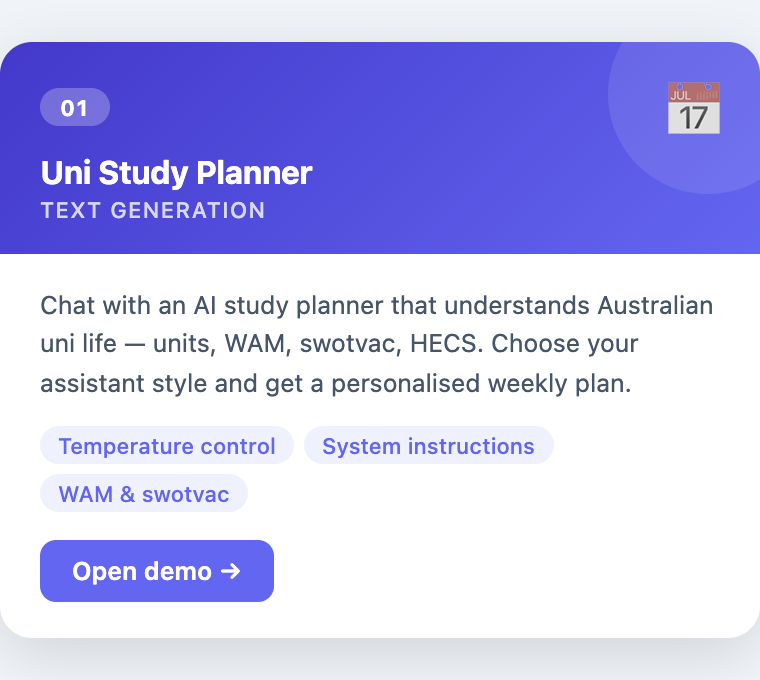

Chat with an AI study planner that understands Australian uni life — units, WAM, swotvac, HECS. Pick from five assistant styles (Structured Planner, Motivational Coach, Exam-Focused Tutor, Flexible Advisor, Pomodoro Specialist) and adjust the temperature slider for strict plans or creative suggestions.

**Key concepts:** `systemInstruction`, `temperature`, `generationConfig`

---

### 02 Weekly Timetable Visualiser

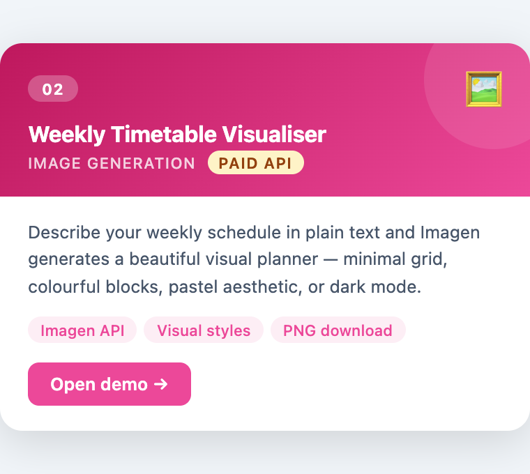

Describe your weekly schedule in plain text and Imagen generates a beautiful visual planner image. Choose from four visual styles: clean minimal grid, colourful blocks, pastel aesthetic, or dark mode planner.

> **Requires a paid API token** — uses the Imagen API (`imagen-4.0-generate-001`).

**Key concepts:** `ai.models.generateImages`, `numberOfImages`, image bytes decoding

---

### 03 Timetable Announcer

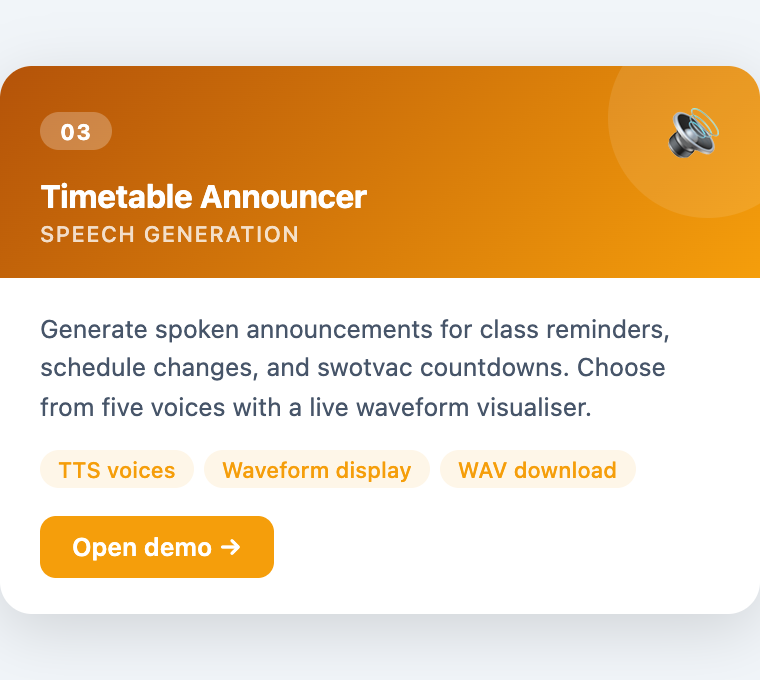

Generate spoken audio announcements for class reminders, schedule changes, and swotvac countdowns. Five voice options with a live waveform visualiser and WAV download.

**Key concepts:** `responseModalities: ['AUDIO']`, PCM-to-WAV conversion, Web Audio API

---

### 04 University Handbook Analyser

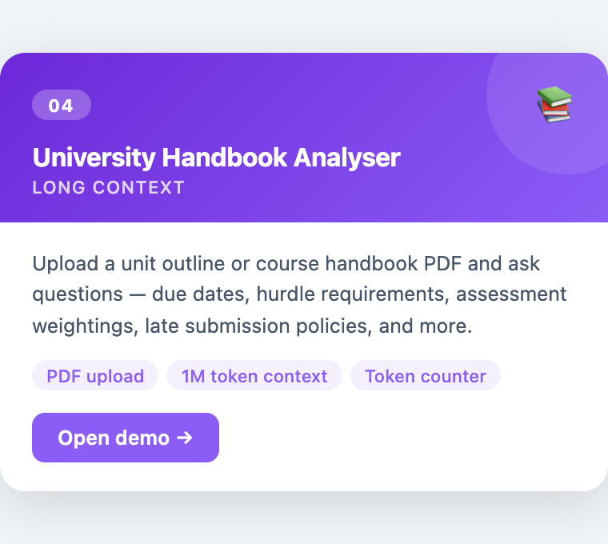

Upload a unit outline or course handbook PDF (or paste a URL) and ask questions about it — due dates, hurdle requirements, assessment weightings, late submission policies. A token count panel shows how much of Gemini's 1M context window you're using.

**Key concepts:** `ai.files.upload`, `ai.files.get` polling, `ai.models.countTokens`, `fileData`

---

### 05 Class Schedule Parser

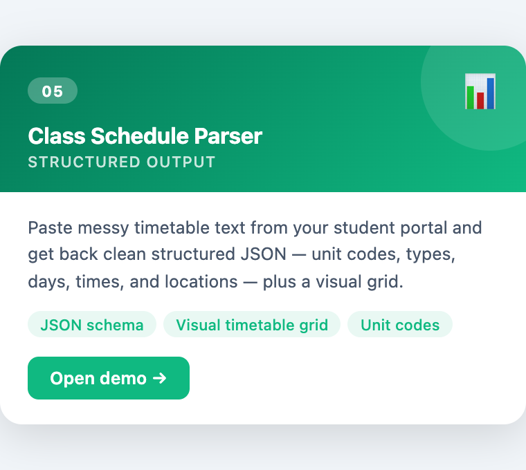

Paste messy timetable text copied from your student portal and get back clean structured JSON. The schema captures unit code, type (lecture/tutorial/lab/workshop), day, start/end time, location, and week pattern. Results render as a colour-coded visual timetable grid alongside the raw JSON.

**Key concepts:** `responseMimeType: 'application/json'`, `responseSchema`, `Type.OBJECT`

---

### 06 Timetable Clash Resolver

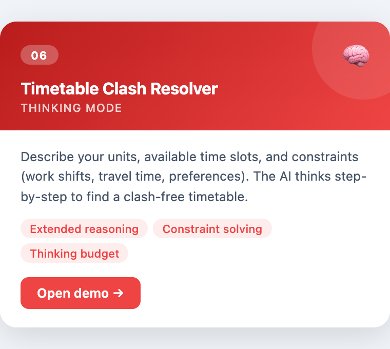

Pre-filled with four units (COMP1010, MATH1001, ECON1010, HIST1205), multiple time slot options, and real constraints (Thursday café shift, 40-min bus commute, fortnightly commitment). The AI's step-by-step reasoning appears in a collapsible panel, with the final clash-free timetable below.

**Key concepts:** `thinkingConfig`, `includeThoughts: true`, `thinkingBudget`, thought vs answer parts

---

### 07 Handwritten Timetable Digitiser

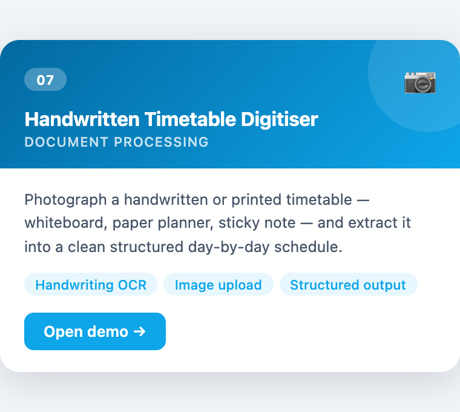

Upload a photo of a handwritten or printed timetable — whiteboard, paper planner, sticky note — and extract it as a structured day-by-day schedule. Uses two Gemini calls: one for a readable text summary, a second with a JSON schema for structured output.

**Key concepts:** `inlineData` (base64 image), multimodal `parts`, two-pass structured extraction

---

### 08 Campus Map & Room Finder

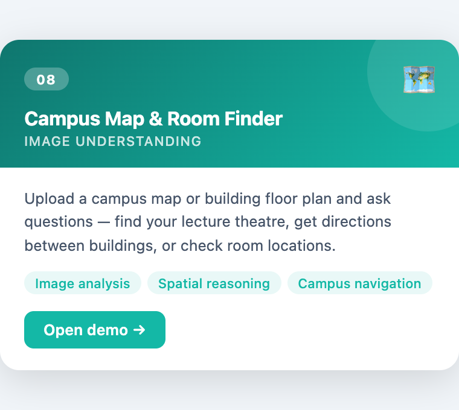

Upload a campus map or building floor plan and ask spatial questions — find a lecture theatre, get directions between buildings, identify what floor student services is on. Side-by-side image + answer layout.

**Key concepts:** `inlineData` image understanding, multimodal prompts, `en-AU` locale

---

### 09 Lecture Recording Summariser

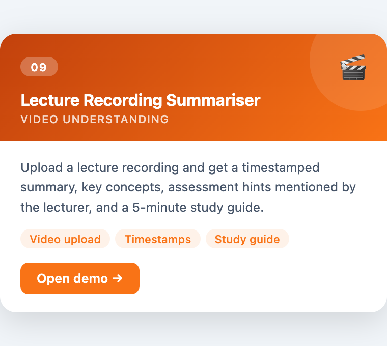

Upload a lecture recording (MP4/WebM) or paste a YouTube URL. Get a timestamped topic summary, key concepts and definitions, any assessment hints or deadlines mentioned by the lecturer, and a 5-minute study guide.

**Key concepts:** `ai.files.upload` (video), Files API polling, `fileData` URI, YouTube URL passthrough

---

### 10 Lecture Audio Transcriber

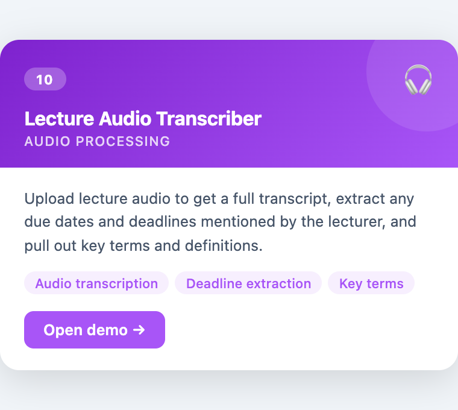

Upload lecture audio (MP3, WAV, M4A) to get a full transcript or summary. A second Gemini call extracts all mentioned deadlines and assessment details as structured JSON, displayed as colour-coded deadline cards in a sidebar.

**Key concepts:** `inlineData` audio (base64), `responseMimeType: 'application/json'` for deadline extraction

---

### 11 Smart Timetable Assistant

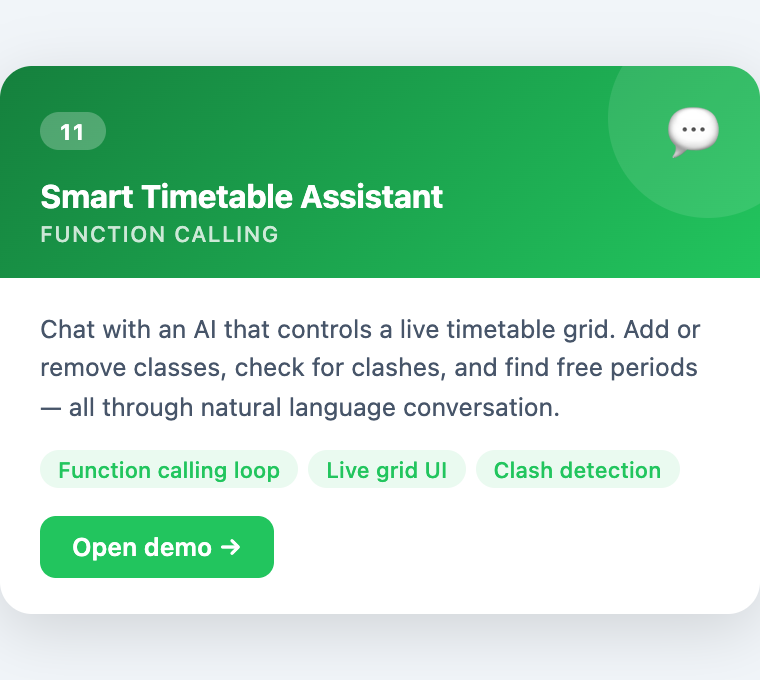

Chat interface on the left, live weekly timetable grid on the right. The AI calls five timetable functions (`add_class`, `remove_class`, `list_classes`, `check_clashes`, `get_free_periods`) to manage the schedule through natural language. The function-calling loop is fully shown.

**Key concepts:** `functionDeclarations`, `tools` config, multi-turn function call → result → response loop

---

### 12 Course Info Lookup


Ask real-time questions about Australian uni courses — prerequisites, semester dates, WAM requirements for honours, special consideration policies. Answers are grounded in live Google Search results with source citations and search query chips.

**Key concepts:** `tools: [{ googleSearch: {} }]`, `groundingMetadata`, `groundingChunks`, `webSearchQueries`

---

### 13 Study Load & WAM Calculator

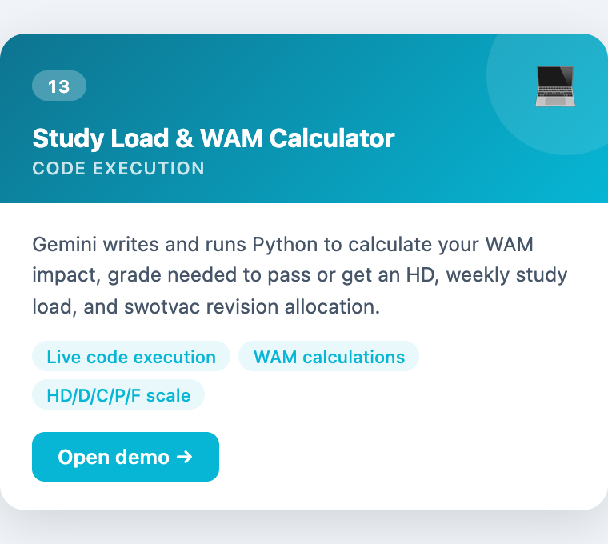

Describe your marks and units, and Gemini generates and runs Python code to calculate WAM impact, the grade needed to pass or hit an HD, weekly study load, and swotvac revision allocation. The generated code and execution output are shown separately.

**Key concepts:** `tools: [{ codeExecution: {} }]`, `executableCode`, `codeExecutionResult`, part parsing

---

### 14 Course Page Analyser

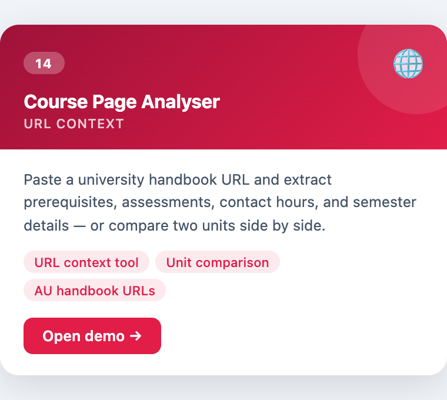

Paste one or two Australian university handbook URLs (ANU, UniMelb, UNSW, UQ, Monash…) and extract prerequisites, assessment weightings, contact hours, and semester details. Two modes: single-unit summary or side-by-side unit comparison.

**Key concepts:** `tools: [{ urlContext: {} }]`, `urlContextMetadata`, markdown rendering with `marked.js`

---

## Quick Start

```bash
git clone https://github.com/joshuacrowley/gemini-html-timetable.git
cd gemini-html-timetable
open index.html
```

Or just drag any `.html` file into your browser.

1. Get a free API key from [Google AI Studio](https://aistudio.google.com/api-keys)
2. Open a demo file in your browser
3. Enter your API key when prompted — it's saved in `localStorage`, so you only need to do this once per demo

## Technical Notes

- Pure HTML/CSS/JavaScript — no frameworks, no bundler
- Uses `@google/genai` (latest) via `esm.sh` CDN
- Each file is fully self-contained
- Responsive — works on desktop and mobile
- All demos include error handling and loading states
- **Demo 02** requires a paid Imagen API plan; all others work on the free tier

## Regenerating Card Images

The `cards/` folder contains @2x PNG preview images for each demo, generated with Puppeteer:

```bash
npm install
node generate-cards.js
```

## Resources

- [Get API Key](https://aistudio.google.com/api-keys)
- [Gemini API Docs](https://ai.google.dev/gemini-api/docs)
- [API Reference](https://ai.google.dev/api)
- [@google/genai SDK](https://www.npmjs.com/package/@google/genai)

## License

Provided as-is for educational purposes.
